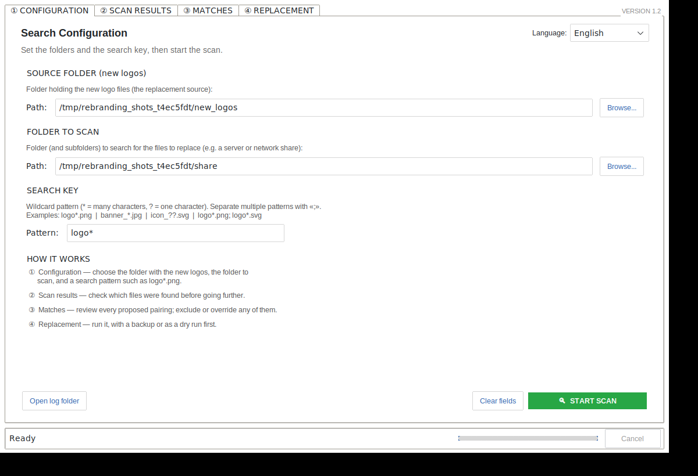
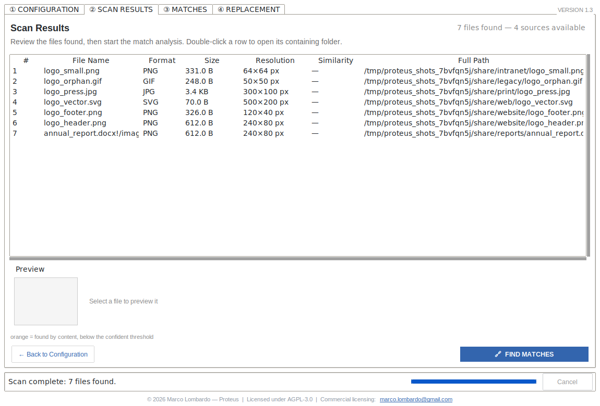
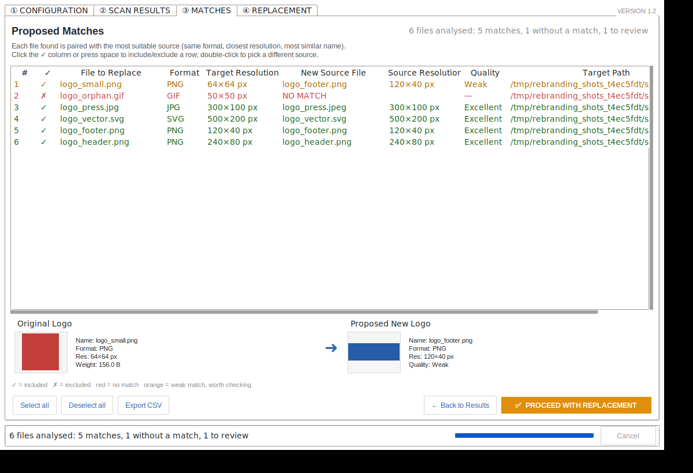
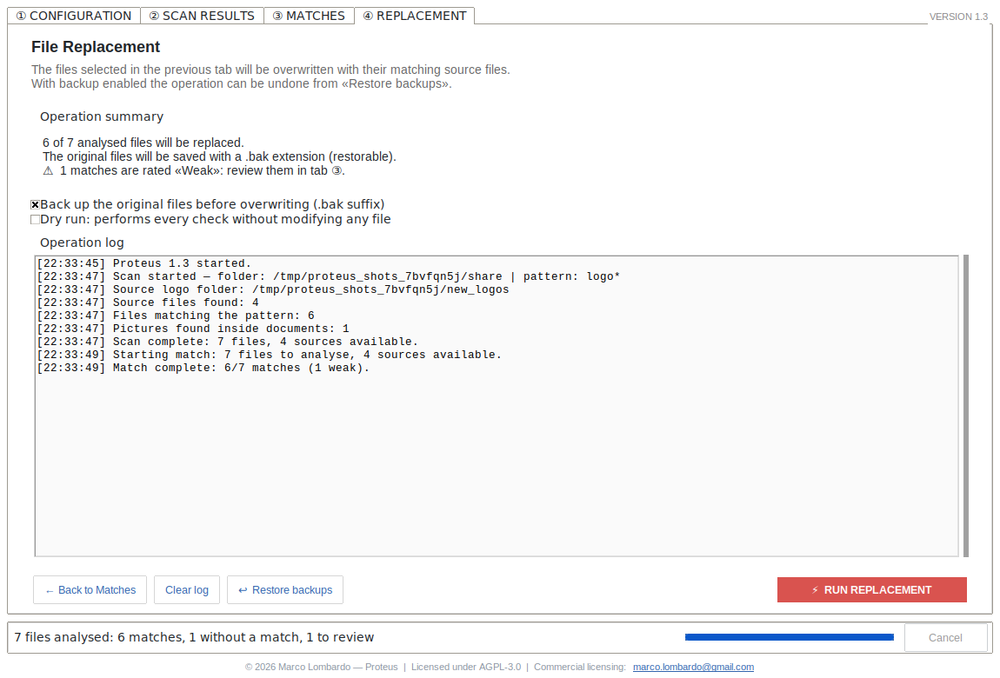
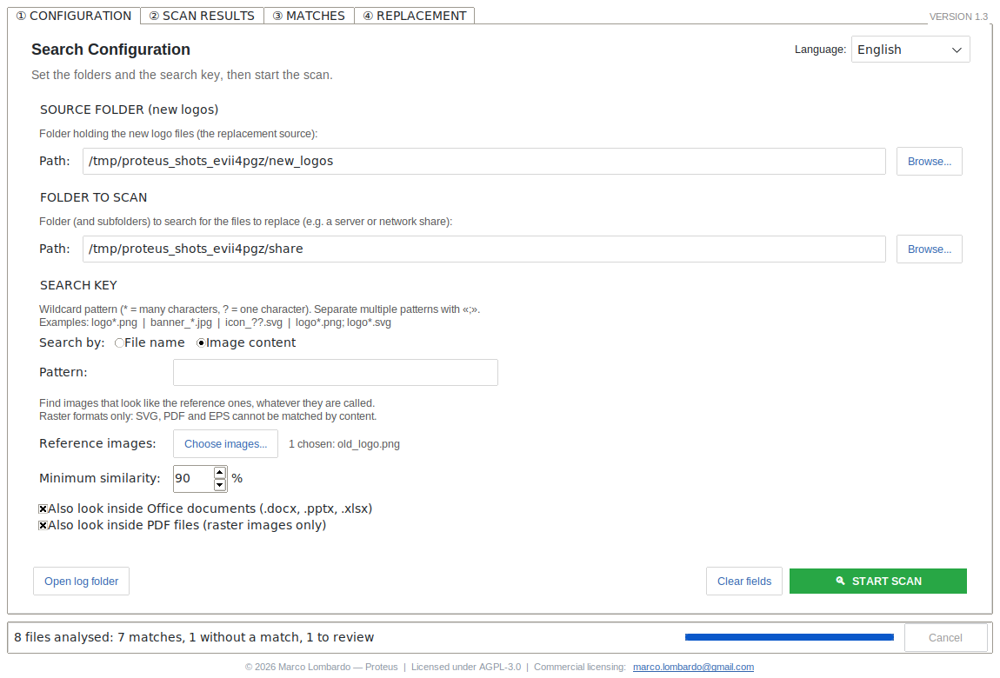
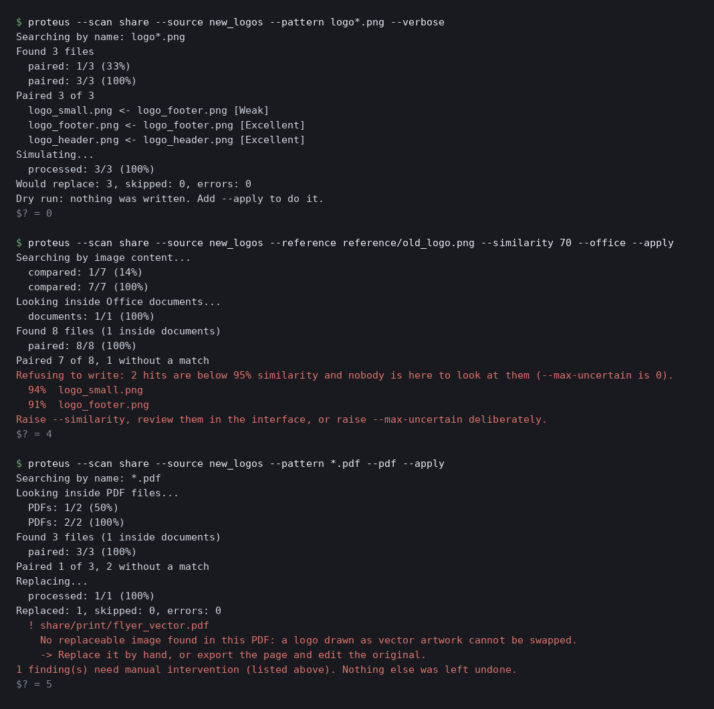

# 🖼️ Proteus - Rebranding Tool

[](https://www.gnu.org/licenses/agpl-3.0)
[](COMMERCIAL-LICENSE.md)
[](https://www.python.org/downloads/)
[](https://github.com/MarcoLombardoDev/Proteus/actions/workflows/ci.yml)

> **Proteus** — named after the shape-shifting sea god — is a rebranding tool: it changes
> what your files look like without changing where they are.

Proteus is a Python desktop application built for one job: **carrying a corporate
rebranding through an organisation's files.** A merger, a name change, a brand refresh —
whatever the trigger, the old logo is suddenly wrong in thousands of places at once, and
somebody has to find and replace every copy of it.

You point it at a folder of new logos and a folder to scan; it finds the files carrying the
old logo — by name, by visual similarity, and inside Office documents and PDFs — pairs each
one with the most suitable replacement, shows you a before/after preview of every pairing,
and then overwrites them **atomically, with recoverable backups**.

It exists because doing this by hand across hundreds of files is slow and, worse, silently
error-prone: it is very easy to drop a 1920×600 banner where a 32×32 favicon belonged.

> 🌍 The interface is available in **English** (default) and **Italian**, switchable at
> runtime from the configuration tab.

---

## Screenshots

> The folders and files below are **synthetic sample data** generated purely to
> illustrate the interface. The coloured rectangles stand in for real logos.

| | |
|---|---|
| **① Configuration** — source folder, folder to scan, search pattern, language | **② Scan results** — every matching file with format, weight and resolution |
|  |  |
| **③ Matches** — proposed pairings, quality grade, before/after preview | **④ Replacement** — summary, backup and dry-run options, live log |
|  |  |

Two rows in tabs ② and ③ are worth a look. `annual_report.docx!/image1.png` is a picture
**embedded in a Word document**, and `brochure.pdf!/p1i1` is one **inside a PDF** — both
found and paired like any loose file. No wildcard would have reached either.

**① in content-search mode** — no pattern at all, just a copy of the old logo:



**The command line**, on the same sample data — a dry run, a refusal, and a PDF campaign:



The last two runs are the ones to read.

The **middle** one found the logo inside the Word document, but two hits were below 95%
similarity, so it **refused to write anything and exited 4** — naming both files and how
to proceed deliberately.

The **last** one replaced the logo inside `brochure.pdf`, then reported that
`flyer_vector.pdf` draws its logo as vector artwork and cannot be touched, with what to do
about it — and **exited 5** rather than 0. It did work, and it also left work behind; a
scheduler that saw `0` would never have told anyone. That is
[the rule](#nothing-is-skipped-in-silence) this tool is built around.

<sub>Generated with [`docs/generate_screenshots.py`](docs/generate_screenshots.py), which boots
the real app under Xvfb against sample data in a temporary folder (no network, and your own
settings are left untouched). The terminal image is not a mock-up either: the script runs
the real command line and draws its actual output, exit codes included. Regenerate after a
UI change with `xvfb-run -a python docs/generate_screenshots.py`.</sub>

---

## Table of Contents

1. [Why this tool](#why-this-tool)
2. [The use case: a corporate rebranding](#the-use-case-a-corporate-rebranding)
3. [Features](#features)
4. [Installation](#installation)
5. [Usage](#usage)
6. [Search patterns](#search-patterns)
7. [Content search](#content-search)
8. [Office documents](#office-documents)
9. [PDF files](#pdf-files)
10. [Nothing is skipped in silence](#nothing-is-skipped-in-silence)
11. [Command line and unattended runs](#command-line-and-unattended-runs)
12. [Matching algorithm](#matching-algorithm)
13. [Safety model](#safety-model)
14. [Backup and restore](#backup-and-restore)
15. [CSV reports](#csv-reports)
16. [Languages](#languages)
17. [Files and folders](#files-and-folders)
18. [Building a standalone executable](#building-a-standalone-executable)
19. [Development](#development)
20. [Requirements](#requirements)
21. [Scope and limitations](#scope-and-limitations)
22. [License & Commercial Licensing](#license--commercial-licensing)
23. [Disclaimer](#disclaimer)

---

## Why this tool

A rebranding exercise is rarely one file. The same logo lives in a dozen resolutions
across a website, an intranet, print templates and legacy folders — `logo_header.png`,
`logo_footer.png`, `logo_small.png`, `logo.svg`, `logo_press.jpg`. Replacing them by hand
means finding each one, guessing which new asset belongs where, and hoping you did not
overwrite something with the wrong size.

Proteus automates the finding and the pairing, but deliberately **keeps the human
in the loop**: nothing is written until you have seen each proposed pairing, and every
pairing carries a quality grade telling you where the automation is confident and where it
is guessing.

When there is no human to keep in the loop — a nightly job, a deployment pipeline, twenty
branch-office shares — the [command line](#command-line-and-unattended-runs) replaces that
supervision with explicit rules rather than dropping it: still a dry run by default, and it
refuses to write when a match is not certain.

---

## The use case: a corporate rebranding

This is what Proteus was built for, and what its defaults assume.

A company changes its brand — a merger, an acquisition, a new name, a visual refresh. The
day the new identity goes live, the old logo is wrong in every place it was ever put, and
nobody has a list of those places. Typically:

| Where | What is there |
|---|---|
| **File server / shared drives** | Years of logos in a dozen sizes, under names nobody agreed on |
| **Website and intranet** | `logo.png`, `logo@2x.png`, favicons, e-mail headers |
| **Templates** | Letterhead, invoices, offer templates, slide masters |
| **Documents already produced** | Reports, presentations and spreadsheets with the logo embedded — where most copies actually are |
| **Print and PDF** | Brochures, datasheets, signed contracts |
| **Departmental and branch shares** | The same problem again, repeated per site |

Three things make this genuinely hard, and each maps to a feature:

1. **You cannot find them by name.** `header_bg.png`, `PROGETTO2014.png`, `img_04.jpg` are
   all the logo. → [Content search](#content-search) finds it by what it *looks like*.
2. **Most copies are not loose files.** They are inside `.docx`, `.pptx`, `.xlsx` and PDFs.
   → [Office documents](#office-documents) and [PDF files](#pdf-files).
3. **Some copies cannot be replaced at all** — a pasted logo, a signed PDF, vector artwork.
   → [Nothing is skipped in silence](#nothing-is-skipped-in-silence): they are listed with
   a remedy so somebody can finish them by hand.

### A campaign, start to finish

The order below is the one the tool is designed around, and each step is safe to stop at.

**1 — Take an inventory before touching anything.** `--audit` counts the copies and says
where they are, without pairing or replacing. **`--source` is not required**: at this stage
the new logo may not even have been designed yet, and demanding one would have forced people
to invent an empty folder just to be allowed to look.

```bash
python main.py --scan //fs01/shared --reference ./brand-old/logo.png \
               --office --pdf --audit --report inventory.csv
```

```
412 file(s) carry the logo, 168 of them inside documents — 84.2 MB in total

By format:
     190  PNG
     134  JPG
      61  PDF
      27  SVG

By folder:
      88  //fs01/shared/Marketing/Templates
      64  //fs01/shared/Sales/Offers
      ...
```

That output *is* the scope of the project, in the terms whoever approves it will ask about:
how many, in which departments, in what formats. The CSV holds every row, and the console
states how many folders it truncated rather than letting the top twenty read as the whole
picture.

`--audit` cannot write, and combining it with `--apply` is refused as an argument error
rather than silently ignored — so this is safe to run against production shares during
office hours.

**2 — Read the findings, not just the matches.** The run also lists what it *cannot* do:
pasted logos, protected documents, vector PDFs. That list is the manual work item, and it is
better to size it now than to discover it after go-live.

**3 — Rehearse one folder in the interface.** Pick the messiest share and walk tabs ① to ④
with **Dry run** ticked. The before/after preview on every pairing is the point: this is
where you catch a 1920×600 banner about to land where a 32×32 favicon belonged.

**4 — Run it for real, with backups on.** Interface for supervised folders, command line for
the rest. Keep `--report` on every run: those CSVs are the audit trail when someone asks
what changed.

**5 — Verify.** Re-run step 1. What comes back is what is left.

> ⚠️ **One caveat on verification, stated plainly.** The visual match is deliberately
> blind to colour, so a *recoloured* new logo still matches the old reference at close to
> 100%. That is right for finding a logo, and wrong for proving one was replaced: a second
> scan cannot distinguish "still the old logo" from "the new logo, same shape". Use the
> replacement report — not a second content scan — as the record of what changed. If the
> new identity has a genuinely different silhouette, verification works normally.

**6 — Undo, if it comes to that.** **Restore backups** reverts to the state before the
first campaign, per folder. Always keep an independent backup as well: see the
[Disclaimer](#disclaimer).

### What it does not do

Worth knowing before it is presented to anyone as a complete solution:

- **It replaces images, not text.** The old *company name* in document bodies, headers,
  footers, alt text, document properties and file names is untouched. That is a real part of
  a rebranding and Proteus does not do it.
- **It does not rename files.** `logo_oldco.png` keeps its name; renaming would break every
  reference to it.
- **It does not touch the inside of an SVG.** SVG files are replaced whole, but brand colours
  or text inside the markup are not edited.
- Vector logos in PDFs cannot be replaced; see [PDF files](#pdf-files).

---

## Features

**Finding**
- **Content search**: find the old logo by what it *looks like*, not by what it is
  called — the half of a rebranding that wildcards cannot solve
- **Inside Office documents**: pictures embedded in `.docx`, `.pptx` and `.xlsx` are found
  and replaced like any other file — which is where most logos actually live
- **Inside PDF files**: raster images in a PDF are found, compared and replaced too. A
  logo drawn as vector artwork cannot be swapped — and is **reported**, not ignored
- Recursive search with wildcard patterns; multiple patterns at once (`logo*.png; logo*.svg`)
- Case-insensitive matching, symlink/junction cycle protection, per-folder error reporting
  so an unreadable network share does not abort the whole scan
- Automatically skips its own `.bak` files, and skips the source folder when it happens to
  sit inside the folder being scanned

**Pairing**
- Same-format constraint, with `.jpg`/`.jpeg` and `.tif`/`.tiff` treated as equivalent
- Closest-resolution selection, normalised so the gap is judged *relative* to the target size
- File-name similarity as a tie-break between equally-sized candidates
- SVG dimensions read from the markup (`width`/`height`, falling back to `viewBox`)
- A **quality grade** per pairing — Excellent / Good / Weak / Manual — with weak matches
  highlighted for review
- Manual override: double-click any row to pick a different source file

**Replacing**
- **Atomic writes**: the copy lands on a temporary file and is promoted with `os.replace`,
  so a failure halfway through never truncates the original
- **Non-clobbering backups**: a second rebranding campaign does not overwrite the first
  campaign's `.bak`
- **Dry run** that performs every check and produces the full log without touching a file
- **One-click restore** from the backups, always reverting to the pre-rebranding original
- Cancellable at any point, with visible progress — designed for slow network shares
- **Nothing is skipped in silence**: any file that may carry the logo but cannot be
  handled is listed with the reason and a suggested remedy, so you can finish it by hand

**Automating**
- A **command line** covering everything the interface does, so the same campaign can run
  as a scheduled task, a cron job or a pipeline step
- **Unattended by design**: a run writes nothing unless asked, refuses on uncertain matches,
  and returns an exit code the scheduler can act on

**Reporting**
- CSV export of the proposed matches and of the replacement outcome
- Rotating log files, with a fallback location when the application folder is read-only
- A permanent licence notice in the window footer, satisfying the "Appropriate Legal
  Notices" requirement of AGPL-3.0 section 5 — with the licensing address spelled out and
  clickable, since the person running the tool is the one who might need to buy a licence

---

## Installation

### Prerequisites

- **Python 3.10 or newer**, including `tkinter`
  - Windows: keep the *tcl/tk and IDLE* option selected in the Python installer
  - Debian/Ubuntu: `sudo apt install python3-tk`
  - Fedora: `sudo dnf install python3-tkinter`
  - macOS (Homebrew): `brew install python-tk`

### Install dependencies

```bash
pip install -r requirements.txt
```

On Windows you can instead double-click **`install_dependencies.bat`**, which also verifies
that `tkinter` is present before installing anything.

### Run

```bash
python main.py
```

| Platform | Shortcut |
|---|---|
| Windows | `run.bat` |
| Linux / macOS | `./run.sh` |

Any argument switches to the [command line](#command-line-and-unattended-runs) instead:

```bash
python main.py --help
```

---

## Usage

The application walks you through four tabs, in order.

### ① Configuration

| Field | Meaning |
|---|---|
| **Source folder** | Where the *new* logos live. Every supported image file in it becomes a replacement candidate. |
| **Folder to scan** | The tree to search for files to replace. Scanned recursively. |
| **Search by** | *File name* (wildcard pattern) or *Image content* (visual similarity). |
| **Search key** | Wildcard pattern for the file names to replace, e.g. `logo*.png`. In content mode it is an optional pre-filter. |
| **Reference images** | Content mode only: one or more copies of the *old* logo to search for. |
| **Minimum similarity** | Content mode only: how close a match must be to count. Defaults to 90%. |
| **Language** | English or Italian, applied immediately. |

The tool refuses to start when the two folders are the same, and warns you when the source
folder is nested inside the scanned one (in which case it is excluded from the search
automatically, so your new logos are never treated as targets).

### ② Scan results

Every matching file with its format, weight, resolution and — after a content search —
its similarity to the reference. Rows below the confident threshold are orange. Select a
row to preview it;
double-click to open its containing folder. Columns are sortable, and sorting is
type-aware — `2.0 MB` ranks above `900 KB`, and `10` after `2`.

### ③ Matches

The heart of the tool. Each target file is shown next to its proposed replacement, with
both resolutions, a quality grade and a side-by-side preview.

- **Click the ✓ column** (or press <kbd>Space</kbd>) to include or exclude a row
- **Double-click a row** to choose a different source file, ordered by suitability
- **Colours**: green = included, grey = excluded, red = no match found,
  orange = weak match worth a look

Rows with no match are excluded automatically; you cannot accidentally replace a file with
nothing.

### ④ Replacement

A summary of exactly what is about to happen, two safety switches, and a live log.

| Option | Effect |
|---|---|
| **Backup** | Copies each original to `.bak` before overwriting. Enabled by default. |
| **Dry run** | Runs every check and produces the full log, writing nothing. |

After a real run you are offered a CSV report of the outcome.

---

## Search patterns

| Pattern | Matches |
|---|---|
| `logo*.png` | Every PNG whose name starts with `logo` |
| `banner_*.jpg` | Every JPG starting with `banner_` |
| `*.svg` | Every SVG file |
| `icon_??.png` | `icon_` followed by exactly two characters, `.png` |
| `logo*.png; logo*.svg` | Several patterns at once, separated by `;` |

Matching is case-insensitive, so `logo*.png` also finds `LOGO_Header.PNG`.

Patterns that would select *every* file (`*`, `?`, or only wildcards) are rejected, as are
patterns containing a path separator — the pattern applies to file names, not paths.

---

## Content search

Wildcards solve the easy half of a rebranding. The hard half is the logo filed as
`header_bg.png`, `img_04.jpg`, or something in a folder named after a project from 2014.
No pattern finds those, because nobody named them after the brand.

Switch **Search by** to *Image content*, point Proteus at one or more copies of the **old
logo**, and it finds every image that looks like them — whatever the file is called.

### How it works

Each image is reduced to a 9×8 greyscale grid and encoded as a 64-bit **difference hash**:
each pixel becomes one bit saying whether it is brighter than its right-hand neighbour.
Two images are compared by Hamming distance over those 64 bits.

Encoding the *gradient* rather than absolute brightness is what makes the hash survive the
three things that happen to a logo as it travels around an organisation: **rescaling**,
**re-encoding**, and **quality loss**. Transparency is flattened onto a fixed white matte
first, so the same mark exported once with an alpha channel and once without still reads
as itself.

### What it will and will not find

| | |
|---|---|
| Same logo at another size | ✅ tested from 60×20 to 960×320 |
| Same logo in another format (PNG/JPEG/BMP/…) | ✅ |
| Heavily re-compressed JPEG | ✅ tested down to quality 35 |
| With or without an alpha channel | ✅ |
| **Recoloured** logo | ✅ — see the caveat below |
| Logo **inside** a Word, PowerPoint or Excel file | ✅ see [Office documents](#office-documents) |
| **Cropped or rotated** logo | ❌ |
| Logo composited into a larger picture | ❌ only whole images are compared |
| SVG, PDF, EPS, EMF/WMF | ❌ nothing to rasterise; use a pattern for those |

### Colour is not what it discriminates on

A difference hash reads **luminance gradients**, and the *shape* is what creates them.
The same silhouette in another colour therefore still matches — measured at 100% for a
green or blue version of a red mark, 98% for black.

That cuts both ways. It is useful, because a logo is found across all its colourways. It
is also the main source of false positives: **two unrelated marks with similar
silhouettes will match too.** What actually breaks a match is a change of shape or
layout — the same test set drops to 70% for a genuinely different picture.

This is the reason the threshold is strict and every hit is previewed before anything is
written.

### Why the threshold is strict

**Minimum similarity** defaults to 90%, and that default is deliberate. Proteus overwrites
files: a false positive here does not produce a wrong row in a list, it destroys an
unrelated image. Lower it knowingly.

Anything found below **95%** is shown in orange and reported in the log, because those are
the rows a human actually needs to look at. The similarity of every hit is shown as a
column and is sortable, and the pattern field still works as a pre-filter to narrow the
search before any image is decoded.

---

## Office documents

In a real rebranding most of the logos are not loose PNGs on a share — they are inside
reports, decks and spreadsheet templates. Tick **Also look inside Office documents** and
Proteus treats a picture embedded in a `.docx` the same as one sitting on disk: it appears
in the results, gets a preview and a match, and is replaced with a backup.

Modern Office files are ZIP packages, and every picture in them is stored as an ordinary
image file under a `media/` folder inside. Proteus reads and rewrites them with the
standard library alone — there is no new dependency, and no Office installation is needed.

Supported: `.docx` `.docm` `.dotx` `.dotm` `.pptx` `.pptm` `.potx` `.potm` `.ppsx`
`.xlsx` `.xlsm` `.xltx` `.xltm`.

### One picture, every occurrence

Office stores a picture **once** however many times it appears. A logo used in the body
*and* in the page header is a single file inside the package, so one replacement fixes
both — and the document is backed up **once**, no matter how many of its pictures change.
That matters: replacing three logos one at a time would otherwise leave three backups of
successive states and no clean copy of the original.

### The frame does not follow the picture

This is the way a bulk replacement can quietly ruin a thousand documents.

The size and position of a picture are stored in the **document**, not in the image. A
shape laid out at 3.33 × 1.11 inches stays 3.33 × 1.11 inches after the image inside it is
swapped. Drop a square logo into a frame built for a 3:1 one and Word stretches it to fit.
Nothing errors; the deck just looks wrong, and nobody notices until it is printed.

Proteus compares the aspect ratio of the old picture with the new one and **flags the
replacement in orange**, listing the count in the operation summary before you commit.
The old picture's own ratio is used as a proxy for the frame, since the frame was almost
certainly sized to it when the image was first inserted.

### Not handled

- **`.doc`, `.ppt`, `.xls`** — the pre-2007 binary formats are OLE compound files, not ZIP
  packages.
- **EMF/WMF metafiles**, which Office produces when a logo is *pasted* rather than
  inserted. They cannot be rasterised by Pillow, so they could be neither previewed nor
  compared — only swapped blindly, which is worse than not touching them. **They are
  reported**, with the remedy: delete the pasted picture and re-insert it with
  *Insert > Pictures*. Pasting is how most logos get into a corporate document, so this is
  the finding you are most likely to see.
- **Password-protected or damaged packages** are reported too, and the two are
  distinguished: a protected `.docx` is an OLE compound file rather than a ZIP, so calling
  it "damaged" would send you looking for the wrong problem.
- Logos drawn with native Office shapes, or composited into a larger picture.

---

## PDF files

Tick **Also look inside PDF files** (or pass `--pdf`) and Proteus reads the raster images
a PDF contains, compares them like any other file, and writes the new logo back into the
document.

### How a PDF stores a picture

Every bitmap a PDF shows is an *image XObject*: a stream of encoded pixels plus a
dictionary giving its width, height, colour space and compression. The page's content
stream then paints it through a transformation matrix. Replacing a logo means swapping the
stream and its dictionary while leaving the reference — and the matrix — untouched.

Proteus uses [**pypdf**](https://pypi.org/project/pypdf/) for this, and specifically its
own `ImageFile.replace()`, which re-encodes the picture and fixes `/Width`, `/Height`,
`/ColorSpace`, `/BitsPerComponent` and `/Length` together. Editing the bytes directly does
work — it was measured before this was built — but it means rebuilding the cross-reference
table by hand, and it goes blind as soon as a producer uses object streams, which modern
writers do. On a tool that overwrites files in place, that is not a trade worth making.

### Any format may replace any picture

Unlike an Office package, where the media file's extension is part of a content-type
contract, a PDF image is re-encoded from pixels on the way in. The **same-format rule is
therefore lifted for PDF rows**: a PNG can replace a JPEG-compressed logo, which is the
normal case — brand assets arrive as PNG, and PDFs store them as JPEG.

### One picture, one entry

Rows appear as `brochure.pdf!/p2i1` — "the first image painted on page 2 of
brochure.pdf". Position is used rather than the PDF object number because
`PdfWriter(clone_from=…)` renumbers objects: an image read as object 1 comes back as
object 4, so a number captured during the scan cannot find the picture again at write
time. Before writing, Proteus checks the picture at that position still has the size the
scan measured, and refuses if it does not — the document changed, and what is there now
was never reviewed.

Several pictures in the same PDF are replaced in **one rewrite and one backup**, exactly as
for Office documents.

### What cannot be replaced — and is reported instead

| Case | Why | What Proteus does |
|---|---|---|
| **A logo drawn as vector paths** | It is not an image at all, so there is nothing to swap | Reports the file when you asked for it by name |
| **Encrypted PDF** | The images cannot be read | Reports it, asks you to remove the password |
| **Digitally signed PDF** | Any byte written invalidates the signature | Refuses and says so |
| **Inline images** | They live inside the content stream, with no object to point at | Reports the page |
| **JPEG 2000, JBIG2, CCITT fax** | Pillow cannot reconstruct the pixels, so the swap would be blind | Reports the picture |
| **Damaged file** | Unparseable | Reports the error |

**Vector logos are the important limitation, not a footnote.** Most print-quality PDFs —
anything out of InDesign, Illustrator or LaTeX — draw the logo as paths. In practice PDF
support covers *office* PDFs, not *press* PDFs. Proteus cannot see a vector logo, so it
cannot tell you the logo is there; what it can say, and does, is "there is nothing
replaceable in this file you pointed me at".

---

## Nothing is skipped in silence

One rule runs through the whole tool:

> **If a file might carry the logo but cannot be dealt with, it is reported — never
> dropped.**

A rebranding that quietly leaves three logos in place is worse than one that stops and
names them, because nobody goes looking for a failure they were never told about. Every
finding carries two things: what is wrong, and what you can do about it by hand.

| Where you are | How findings reach you |
|---|---|
| **Interface** | A red bar above the results — *"N files may carry the logo but could not be handled automatically"* — with **Show details** listing each one and its remedy. Hidden entirely when there is nothing to report, so it never becomes wallpaper. |
| **Log file** | One `WARNING` line per finding, with path and reason. |
| **Command line** | Printed to **stderr**, and **`--quiet` does not suppress them**: progress is noise, this is not. |
| **Scheduled job** | Exit code **5**. |

Exit code 5 is the part that matters when nobody is watching. A run that replaced what it
could and left a vector logo behind is *not* a clean run, and a scheduler that saw `0`
would never tell anyone. So:

```
0  everything done
5  done what it could — findings listed, a person is needed
```

### Why the vector warning depends on the pattern

A PDF containing no raster image is only reported when its **name matched your pattern**.
Search a tree of ten thousand PDFs by image content and reporting every one of them would
produce a warning list nobody can read, which is as useless as no warning at all. Pointing
at a file by name is what makes "nothing replaceable in here" a finding rather than noise.

To audit a folder of PDFs deliberately, name them:

```bash
python main.py --scan /srv/print --source ./new-logos --pattern "*.pdf" --pdf
```

---

## Command line and unattended runs

Everything the interface does is also available without one. Pass any argument and Proteus
runs as a command-line tool instead of opening a window — same entry point, same logic,
no window server needed:

```bash
python main.py --scan /srv/intranet --source ./new-logos --pattern "logo*.png"
```

That command **changes nothing**. A run is a dry run unless you add `--apply`, because the
default has to be the safe one when nobody is watching the screen.

```bash
python main.py --scan /srv/intranet --source ./new-logos \
               --pattern "logo*.png" --apply --report campaign.csv
```

### Why this exists

The interface asks you to look at each pairing before it writes. That is exactly right when
a person is present, and useless in three situations:

| Situation | What the interface cannot do |
|---|---|
| Nightly job on a file server | Nobody is there to click ④ *Replace* |
| A build or deployment pipeline | No display, and a failure must stop the pipeline |
| Twenty branch-office shares | The same campaign, repeated by hand twenty times |

**Unattended** simply means "runs to completion with no human in front of it": a scheduled
task, a cron job, a pipeline step. The safety a person would provide — noticing a wrong
pairing before it is written — has to be encoded in the arguments instead.

### The safety model, without a human

Three rules replace the operator's eyes. All three can be overridden, but only deliberately:

| Rule | Default | Override |
|---|---|---|
| Nothing is written | Dry run | `--apply` |
| An uncertain hit refuses the whole run | 0 tolerated | `--max-uncertain N` |
| A replacement that would stretch a picture in a document refuses the run | forbidden | `--allow-distortion` |

An **uncertain hit** is a content-search match below 95% similarity — the ones the interface
would colour for review. Name-based matches are never uncertain: you asked for that pattern
explicitly.

A refusal is not a silent no-op. The offending files are listed, the CSV report is still
written if you asked for one, and the exit code says why.

### Exit codes

The whole point of a scheduled job: the scheduler must be able to tell what happened.

| Code | Meaning |
|---|---|
| `0` | Done — or a dry run that found work |
| `1` | Finished, but some replacements failed |
| `2` | Nothing matched |
| `3` | Bad request: missing or invalid arguments, unreadable folder |
| `4` | Refused on safety grounds — uncertain hits or a distortion |
| `5` | Did what it could, but findings need a person — see [Nothing is skipped in silence](#nothing-is-skipped-in-silence) |
| `130` | Interrupted (Ctrl-C) |

`2` is deliberately not an error. A weekly job finding nothing left to rebrand has succeeded.

### Options

```
what to scan
  --scan FOLDER            folder to search for files to replace
  --source FOLDER          folder holding the new logos

how to find it
  --pattern GLOB           wildcard, e.g. "logo*.png"; several separated by ";"
  --reference IMAGE...     one or more copies of the OLD logo — content search
  --similarity PCT         minimum visual similarity for --reference (default 90)
  --office                 also look inside .docx/.pptx/.xlsx documents
  --pdf                    also look inside PDF files (raster images only)

what to do
  --apply                  actually write. Without it nothing is modified.
  --no-backup              do not keep a .bak of each original (not advised)
  --restore                restore originals from their backups and exit
  --audit                  inventory only: what carries the logo and where.
                           No --source needed, and it never writes.

safety
  --max-uncertain N        tolerate at most N hits below 95% similarity
  --allow-distortion       allow replacements that would stretch a picture

output
  --report FILE.csv        CSV of what was found and done
  --language {en,it}       language of messages and report headers
  --quiet                  only report problems
  --verbose                one line per file
```

`--restore` is a dry run by default too, and it also honours `--apply`.

### Scheduling it

Progress goes to stdout, problems to stderr, so redirecting the two separately gives you a
log and an alert channel:

```bash
# /etc/cron.d/rebranding — every Sunday at 03:00
0 3 * * 0 rebrand /opt/proteus/run.sh --scan /srv/shares --source /srv/brand/2026 \
    --reference /srv/brand/old-logo.png --office --apply \
    --report /var/log/proteus/$(date +\%F).csv >>/var/log/proteus/run.log 2>&1
```

```powershell
# Windows Task Scheduler
schtasks /create /tn "Rebranding" /sc weekly /d SUN /st 03:00 /tr `
  "C:\Proteus\Proteus.exe --scan \\fs01\shares --source C:\Brand\2026 --pattern logo*.png --apply"
```

`Proteus.exe` is the one executable for both uses — see
[Building a standalone executable](#building-a-standalone-executable) for how it manages
to be both a console program and a double-clickable app.

### Trying it safely

The honest way to adopt this is in three steps, and the exit code tells you when to move on:

1. `--verbose` with no `--apply` — read every proposed pairing.
2. Add `--report` and open the CSV.
3. Add `--apply`. Keep backups; `--restore` undoes the campaign.

---

## Matching algorithm

For each file to replace, candidates are filtered and then ranked.

**1. Same format (hard constraint).** A `.png` is only ever replaced by a `.png`. The only
equivalences are `.jpg`↔`.jpeg` and `.tif`↔`.tiff`.

**2. Closest resolution (dominant criterion).** Among the candidates, the one whose
resolution is nearest wins. The gap is the euclidean distance between the two resolutions,
**normalised over the target's diagonal**:

```
distance = √((w₁-w₂)² + (h₁-h₂)²) / √(w₁² + h₁²)
```

Normalising matters: a 20 px difference is a serious mismatch on a 32×32 icon and
irrelevant on a 1920×1080 banner. An absolute distance would treat them the same.

**3. File-name similarity (tie-break).** When several sources share a resolution, the one
whose name is most similar to the target wins, measured with `difflib.SequenceMatcher`
over the file stems.

The ranking score combines the last two at 65% resolution / 35% name. The **grade shown to
you**, however, depends on the resolution gap *alone* — name similarity decides which
candidate is chosen, but it must never make a pixel-perfect match look worse:

| Grade | Relative resolution gap |
|---|---|
| **Excellent** | ≤ 10% |
| **Good** | ≤ 35% |
| **Weak** | above 35% — review by hand |
| **Manual** | you chose the source yourself |
| **—** | no candidate of that format exists |

For formats whose resolution cannot be read (PDF, EPS) the grade falls back to name
similarity alone.

---

## Safety model

Bulk-overwriting files on a shared drive deserves care. The guarantees are:

| Risk | Mitigation |
|---|---|
| Copy fails halfway, leaving a truncated file | Copy to a temporary file in the same folder, then promote with `os.replace` (atomic on one filesystem) |
| Second campaign destroys the pristine original | Backups never overwrite an existing `.bak`; later ones get a timestamp |
| Source and target are the same file | Detected via `os.path.samefile` and skipped with an explicit message |
| Source folder nested in the scanned tree | Excluded from the scan automatically |
| Replacing a file with nothing | Rows without a match cannot be enabled |
| Content search hitting an unrelated image | Strict default threshold, similarity shown per row, uncertain hits coloured and logged |
| A replacement silently distorting a picture in a document | Aspect ratios compared, mismatches coloured and counted in the summary |
| A logo the tool cannot replace being left behind unnoticed | Reported in the interface, the log, on stderr and as exit code 5 — never dropped |
| A PDF picture changing between the scan and the write | Stream size compared against what the scan measured; the write is refused |
| A folder the scan could not enter | Reported as a finding: "we scanned everything" is false while one branch was refused |
| A path longer than Windows allows | The extended-length form is used for every read and write, so 260 characters is not a ceiling |
| A file open in Word or Excel | Reported as "open in another program", with the remedy — not as a permissions error |
| A document rewritten while several of its pictures change | Grouped per document: rewritten once, backed up once, atomically |
| Unsure about a whole campaign | Dry run reproduces the entire operation without writing |
| Nobody watching an automated run | The command line is a dry run unless `--apply`, and refuses to write when any hit is uncertain or would distort |
| Wrong replacement already applied | Restore from backups reverts to the pre-rebranding state |
| Long scan on an unresponsive share | Cancellable, with per-folder error reporting rather than a hard abort |

---

## Backup and restore

With **Backup** enabled, each original is copied before being overwritten:

| Campaign | Backup file |
|---|---|
| First | `logo.png.bak` |
| Later ones | `logo.png.20260812-101500.bak` |

**Restore backups** in tab ④ walks the scanned folder, and for every file with backups it
restores the **oldest** one — the version predating the first replacement, which is what
"undo the rebranding" actually means. You are asked whether to delete the `.bak` files
afterwards.

Backup files are excluded from scans, so they never become replacement targets themselves.

---

## CSV reports

Both exports use `;` as the separator and a UTF-8 BOM, so they open cleanly in Excel with
European locale settings.

- **Matches export** (tab ③): inclusion flag, target and source names, both resolutions,
  weight, grade, numeric score and both full paths.
- **Outcome report** (offered after a real run): status, file, source, backup path and any
  error message, one row per file.

Column headers follow the interface language.

---

## Languages

English is the default and the source language of every message. Italian is fully
translated. The choice is persisted and applied immediately — the interface is rebuilt in
place, keeping your scan results, your pairings and your log.

Adding a language means adding one dictionary to `CATALOGUES` in
[`i18n.py`](i18n.py). Anything you do not translate falls back to English rather than
showing a placeholder. Three tests keep the catalogues honest:

- every string passed through `t()` has an entry,
- no entry is stale,
- `{placeholders}` are preserved across languages (a dropped one would raise in front of
  the user).

---

## Files and folders

```
├── main.py                       # Entry point
├── core.py                       # Logic: scan, match, replace, backup, CSV, settings
├── rebranding_tool.py            # Tkinter interface
├── i18n.py                       # Translation layer and language catalogues
├── office.py                     # Reading and rewriting pictures inside OOXML packages
├── pdf.py                        # Reading and replacing raster images inside PDFs
├── paths.py                      # Long Windows paths and readable filesystem errors
├── cli.py                        # Command line and unattended runs
├── build.py                      # PyInstaller build
├── app.ico                       # Application icon (generated)
├── assets/generate_icon.py       # Regenerates app.ico
├── docs/generate_screenshots.py  # Regenerates the README screenshots
├── docs/screenshots/             # Committed screenshots
├── requirements.txt              # Runtime dependencies
├── requirements-dev.txt          # Test dependencies
├── run.bat / run.sh              # Launchers
├── install_dependencies.bat      # Windows dependency setup
├── compile.bat                   # Windows build shortcut
├── tests/                        # logic, GUI, i18n, build, content, office, CLI, docs
├── CLAUDE.md                     # Conventions for anyone working on the repo
├── LICENSE                       # AGPL-3.0
├── COMMERCIAL-LICENSE.md         # Commercial terms and price list
└── CLA.md                        # Contributor License Agreement
```

`core.py` has **no tkinter dependency**, which is what makes the logic testable without a
display and reusable from a script.

**Runtime data** is written next to the application, in `logs/` and `config/`. If that
location is read-only — the typical `C:\Program Files` install — both fall back to
`%LOCALAPPDATA%\Proteus\` (or `~/.local/share/Proteus/` elsewhere). Logs
rotate at 2 MB, keeping five files.

---

## Building a standalone executable

```bash
python build.py
```

On Windows, `compile.bat` does the same. The result is **one** single-file executable in
`dist/Proteus.exe` (~21 MB), with the icon embedded and a `logs/` folder prepared alongside
it — usable both ways:

```
Proteus.exe                    opens the interface
Proteus.exe --help             the command line, for scripts and scheduled jobs
```

That takes a deliberate trade-off to pull off. PyInstaller builds an executable as either
`--windowed` or `--console`, not both: a `--windowed` one has no console at all, so the CLI
half would print into nothing, and a failed scheduled job could never be diagnosed. So the
build is `--console`, which means double-clicking it for the *interface* would normally
flash a console window open first. `main.py` hides that window itself — via
`GetConsoleWindow`/`ShowWindow`, before the GUI branch does anything else — the moment it
determines no arguments were given. The trade is a brief flash for shipping one file
instead of two; it is cosmetic, not a bug to chase further.

Running from source (`python main.py`) never shows this at all: the hiding only fires when
`sys.frozen` is set, i.e. inside the built executable.

The build script installs anything missing, picks the right `--add-data` separator for the
platform, and falls back to the running interpreter when the Windows `py` launcher is not
available.

### Building without a Windows machine

`build.py` has to run on Windows to produce a real `.exe` — PyInstaller cross-compiles for
nothing. If you are on Linux or macOS,
**[`.github/workflows/build.yml`](.github/workflows/build.yml)** does the build for you on a
genuine `windows-latest` GitHub Actions runner:

1. On GitHub, open **Actions → Build Windows executable → Run workflow**.
2. Wait for the run to finish (a few minutes: it runs the test suite, then builds).
3. Download `Proteus-windows-exe` from the run's **Artifacts** section.

The same workflow also fires automatically when a tag matching `v*` is pushed, so tagging a
release produces the executable without a manual step. It is separate from the build check
in `ci.yml`, which runs on every push purely to catch a broken build early — that one exists
to protect CI, this one exists to hand you a file.

---

## Development

```bash
pip install -r requirements-dev.txt

python -m pytest                 # Windows / macOS
xvfb-run -a python -m pytest     # Linux (the GUI tests need a display)
```

The suite is spread across ten files:

| File | Covers |
|---|---|
| `tests/test_core.py` | Scanning, matching, atomic replacement, backups, restore, CSV, settings, plus an end-to-end campaign |
| `tests/test_gui.py` | Startup, the full wizard flow, dry run, row toggling, sorting, manual override, restore, language switching, shutdown |
| `tests/test_i18n.py` | Translation layer, catalogue completeness and placeholder integrity |
| `tests/test_build.py` | Console encoding, platform separators, launcher choice and build prerequisites |
| `tests/test_content_search.py` | Perceptual hashing across scales, formats and transparency — and, just as important, what must *not* match |
| `tests/test_office.py` | Real .docx/.pptx/.xlsx built and re-opened with the official libraries, package rewriting, backups, aspect-ratio guarding, and the pasted/protected cases that must be reported |
| `tests/test_pdf.py` | Real PDFs built and re-opened with pypdf: finding, replacing, the staleness guard, and every case that must be reported instead |
| `tests/test_cli.py` | Every exit code, the safety refusals and their overrides, reports, restore, output control and entry-point dispatch |
| `tests/test_docs.py` | Screenshots referenced and shown, the price list agreeing with itself, and the AGPL text left verbatim |
| `tests/test_paths.py` | Extended-length paths, and every filesystem error turned into a reason with a remedy. Two tests need real Windows and run in CI there |

GUI tests run headless and are skipped automatically where no display exists. A `conftest`
fixture neutralises every modal dialog, so a test that reaches an unexpected `askyesno`
fails instead of hanging the suite forever.

CI runs the suite on **Ubuntu and Windows** against **Python 3.10 and 3.12**, and then
builds the Windows executable so a broken build surfaces before distribution.

To regenerate the artwork or the documentation images:

```bash
python assets/generate_icon.py
pip install mss && xvfb-run -a python docs/generate_screenshots.py
```

The screenshot script needs `mss`, and `python-docx` for the Office sample document — it
skips that one file with a message rather than failing if the library is absent. The
terminal image is produced by running the real command line and drawing its output, so it
cannot drift out of step with the code.

---

## Requirements

| Package | Required? | Why |
|---|---|---|
| `pillow` ≥ 9.1 | **Yes** | Image previews and resolution reading. 9.1 is the floor because of `Image.Resampling`. |
| `tkinter` | **Yes** | The interface. Ships with Python, but packaged separately on Linux. |
| `pypdf` ≥ 4.0 | For PDFs | Finding and replacing images inside PDF files. BSD-3-Clause. Without it the app runs normally and the PDF option reports that the package is missing. |
| `ttkbootstrap` ≥ 1.10 | Optional | Nicer theming. Without it the app uses standard ttk themes; either major version works. |
| `pyinstaller` ≥ 5.13 | Build only | Producing the standalone executable. |
| `mss` | Docs only | Capturing the README screenshots. |

Without Pillow the application still runs and still replaces files — it just cannot show
previews or read resolutions, and says so on the configuration tab.

---

## Scope and limitations

- **Content search discriminates on shape, not colour.** A recoloured logo still matches;
  an unrelated mark with a similar silhouette may match too. Cropping and rotation defeat
  it entirely.
- **Only whole images are compared.** A logo composited into a larger picture, or drawn
  with native Office shapes rather than inserted as a picture, is not found.
- **Legacy Office formats are out of scope.** `.doc`, `.ppt` and `.xls` are OLE compound
  files, not ZIP packages. So are EMF/WMF metafiles, which Office produces when a logo is
  *pasted* rather than inserted.
- **In PDFs, only raster images are replaceable.** A logo drawn as vector paths — the norm
  in print-quality PDFs — cannot be swapped, and Proteus cannot even see it. Encrypted and
  signed PDFs are refused. All of these are reported rather than skipped, but reporting is
  not replacing: PDF support is for office documents, not for press-ready artwork.
- **Previews and resolutions are unavailable for EPS and PDF.** Pillow cannot read them
  without Ghostscript. Files of those types can still be matched, graded by name
  similarity, and replaced.
- **SVG resolution comes from the markup.** An SVG sized only in percentages or relative
  units reports no resolution, and falls back to name-based grading.
- **Replacement is byte-for-byte.** The tool copies the source file; it does not convert
  formats or rescale images. A 500×200 source stays 500×200 after replacing a 240×80 target.
- **Atomicity is per file, not per campaign.** Each file is replaced atomically, but a run
  interrupted midway leaves earlier files already replaced. That is what the backups and
  the restore button are for.
- **`os.replace` is atomic only within one filesystem.** The temporary file is created in
  the target's own folder, so this holds in practice, including on mapped network drives.
- **The command line trades review for rules.** Its refusals are threshold-based; they
  catch an uncertain match, not a confidently wrong one. A first campaign is still worth
  running through the interface, or at least as a dry run with `--report`.
- The Windows executables are built and published by CI; local builds have been verified on
  Linux.

---

## License & Commercial Licensing

Proteus is open-source software released under the
**[GNU Affero General Public License v3.0 (AGPL-3.0)](LICENSE)**.

Copyright © 2026 Marco Lombardo.

**The free build is the whole product.** Every feature documented above is in it. There is
no paid edition, no feature gate, no licence key, no seat limit and no phone-home. If
AGPL-3.0 works for you, you are done reading — Proteus is yours to use.

### What AGPL-3.0 Means for You

| Use Case | Allowed? | Obligation |
|---|---|---|
| Internal use, any number of machines and users | ✅ Yes | None |
| Modify it and keep the changes to yourself | ✅ Yes | None |
| Fork & publish on GitHub | ✅ Yes | Must stay AGPL-3.0 |
| Redistribute it, modified or not, under AGPL-3.0 | ✅ Yes | Must ship the source |
| Deploy a modified version as a network service | ✅ Yes | Must publish the source of your modified version |
| Integrate into a **closed-source product** | ⚠️ Restricted | Requires a commercial licence |
| Offer as a **proprietary SaaS** without sharing source | ❌ Not under AGPL | Requires a commercial licence |
| **Resell** it, or ship it inside a product you sell | ❌ Not under AGPL | Requires a commercial licence |

The dividing line is one rule: **AGPL-3.0 is free as long as the source stays open.**


### Commercial Licensing

The commercial licence removes the copyleft obligation, and nothing else. It is for
organisations embedding Proteus in a proprietary product, running a modified version as a
service without publishing the source, reselling it under their own terms — or simply
barred by internal policy from using AGPL code.

| Tier | Price | Scope |
|---|---:|---|
| **Community** | **Free** | Everything Proteus does, under AGPL-3.0. Unlimited internal use. |
| **Internal** | **€500 / year** | Closed-source internal use, one legal entity. No redistribution. |
| **OEM / Redistribution** | **€1,900 / year** | Embed it in a product you sell, or run it as a hosted service. |
| **Enterprise** | **from €2,900 / year** | Group-wide, unlimited products, procurement and legal questionnaires answered. |
| **Perpetual** | **€1,500** / **from €7,000** one-off | Internal or OEM scope, bought once, for the major version current at purchase. |

The same commitments apply at every paid tier:

- **Email support is always included** — 5 business days at Internal, 3 at OEM, 2 at
  Enterprise. It is never sold separately to a paying customer.
- **Custom development is never included**, at any tier. It is available on request and
  **quoted separately**, per project, at a fixed price agreed before work starts
  (indicative day rate: **€450 / day**).
- **Perpetual fallback, no retroactive price rise, cancel any time.** Versions released
  during your term stay licensed to you forever.
- **50% off** for organisations under 10 employees and €1M revenue. **Free** commercial
  licences for non-profits, academia and published research — ask.

Prices are per organisation, excluding VAT. **Seats are never counted.** Full terms, what is
*not* included, and the third-party component review:
**[COMMERCIAL-LICENSE.md](COMMERCIAL-LICENSE.md)**.

### How to get in touch

Everything commercial — buying a licence, asking for a quote, commissioning custom
development, or checking whether you need a licence at all (the answer is often *no*) —
goes to one address:

> **[marco.lombardo@gmail.com](mailto:marco.lombardo@gmail.com?subject=Proteus%20commercial%20licence%20enquiry)** — Marco Lombardo

The same address is shown in the application's footer, and clicking it opens your mail
client on a pre-filled enquiry. Please keep **GitHub Issues for bugs and feature
requests**, not for licensing.

### Contributing

Contributions are welcome. All contributors must agree to the
[Contributor License Agreement (CLA)](CLA.md) before a Pull Request can be merged. The CLA
grants the Project Owner the right to dual-license contributions under AGPL-3.0 and
commercial terms — this is what makes the dual-licensing model sustainable.

> **To agree to the CLA:** include
> `I have read and agree to the Contributor License Agreement (CLA.md).`
> in your Pull Request description.

One project-specific rule: since this tool exists to replace brand assets, **contributions
must not introduce third-party logos, icons or trademarks**. Sample images, test fixtures
and screenshots use neutral synthetic artwork only.

---

## Disclaimer

This software **overwrites files in place**. It ships with backups enabled by default, a
dry-run mode and a restore function, and every write is atomic — but no safety net replaces
your own backups.

Before running a campaign against a production file server or a shared drive:

1. run it with **Dry run** enabled and read the log,
2. keep **Backup** enabled for the real run,
3. make sure you have an independent backup of the target tree.

The software is provided **"as is", without warranty of any kind**, as set out in sections
15 and 16 of the AGPL-3.0. The authors accept no liability for data loss or for any damage
arising from its use.

---

*Copyright © 2026 Marco Lombardo. Licensed under AGPL-3.0 — commercial licensing available.*
